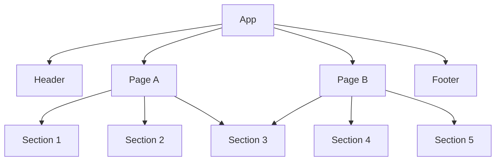

# FrontendAngular

This project was generated with [Angular CLI](https://github.com/angular/angular-cli) version 13.3.2.

## Development server

Run `ng serve` for a dev server. Navigate to `http://localhost:4200/`. The application will automatically reload if you change any of the source files.

## Code scaffolding

Run `ng generate component component-name` to generate a new component. You can also use `ng generate directive|pipe|service|class|guard|interface|enum|module`.

## Build

Run `ng build` to build the project. The build artifacts will be stored in the `dist/` directory.

## Running unit tests

Run `ng test` to execute the unit tests via [Karma](https://karma-runner.github.io).

## Running end-to-end tests

Run `ng e2e` to execute the end-to-end tests via a platform of your choice. To use this command, you need to first add a package that implements end-to-end testing capabilities.

## Further help

To get more help on the Angular CLI use `ng help` or go check out the [Angular CLI Overview and Command Reference](https://angular.io/cli) page.

## Architecture

This projects follows the guidelines set by Angular with regards to [project file structure](https://angular.io/guide/file-structure).

### Source structure

|Folder| Purpose|
|-|-|
|`src/app/`|This is the top-level source folder. Here you will find the classes and modules that are used across the entire application.|
|`src/app/pages`|This folder is used to store modules that represent a single page in the application. These modules usually build pages out of modules of multiple `sections`.|
|`src/app/sections`|This folder contains modules that are reusable components that can be included in any page.|

This application follows a hierarchy of three distinct layers, the `top-level` modules, `page` modules and `section` modules. Each layer can only include modules from the layer above it, except for `section` modules, those can include other modules from the same section.

